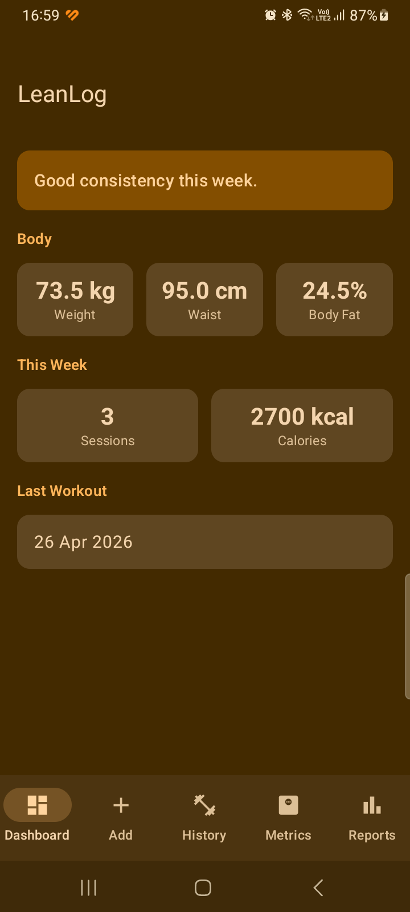
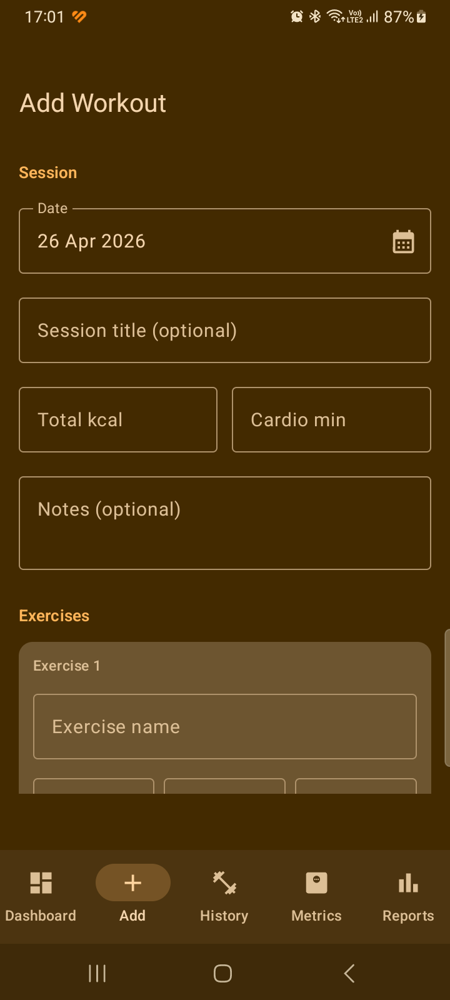
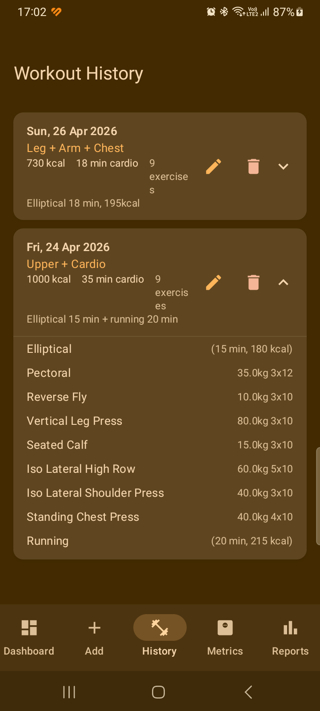
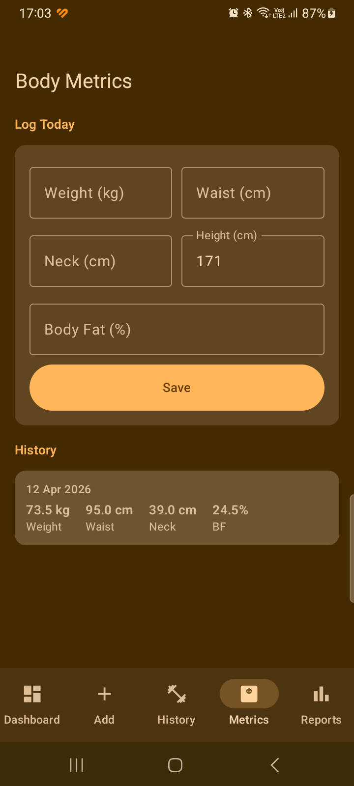
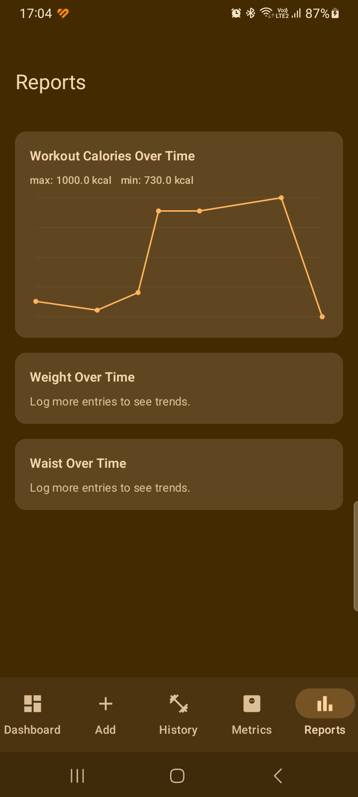

# LeanLog

A local-first Android app for tracking gym workouts and body metrics — no cloud, no login, no bloat.

Built as a personal tool to move from messy notes to structured logging, basic visualization, and body composition tracking.

---

## Screenshots

| Dashboard | Add Workout | History |
|:---------:|:-----------:|:-------:|
|  |  |  |

| Body Metrics | Reports |
|:------------:|:-------:|
|  |  |

---

## Features

- **Dashboard** — latest weight, waist, body fat %, weekly session count and calorie total, last workout date
- **Add Workout** — date picker, session header (calories, cardio minutes, notes), unlimited exercise entries (name, weight, sets, reps, difficulty)
- **Workout History** — sessions listed newest-first, expandable exercise detail, edit and delete per session
- **Body Metrics** — log weight, waist, neck, height; body fat auto-calculated via US Navy formula; full history list
- **Reports** — Canvas-based line charts for workout calories, weight, and waist over time

All data is stored locally with Room (SQLite). Six representative workout sessions are seeded from an April 2026 log on first launch.

---

## Tech Stack

| Layer | Technology |
|---|---|
| Language | Kotlin |
| UI | Jetpack Compose + Material 3 |
| Navigation | Navigation Compose |
| Database | Room + KSP |
| Architecture | ViewModel + Repository (no DI framework) |
| Charts | Compose Canvas (no external chart library) |
| Min SDK | API 28 (Android 9) |

---

## Project Setup

### Prerequisites

```bash
sudo apt update
sudo apt install openjdk-17-jdk git unzip
sudo snap install android-studio --classic
```

### Create the base project

1. Open Android Studio
2. New Project → Empty Activity
3. Settings:
   - Name: `LeanLog`
   - Package: `com.solufast.leanlog`
   - Language: Kotlin
   - Minimum SDK: API 28
   - Build configuration: Kotlin DSL

### Build

```bash
./gradlew assembleDebug
```

### Install on connected device (USB debugging enabled)

```bash
./gradlew installDebug
```

Or open the project in Android Studio and press **Run**.

---

## Project Structure

```
app/src/main/java/com/solufast/leanlog/
├── data/
│   ├── db/
│   │   ├── LeanLogDatabase.kt
│   │   ├── dao/         WorkoutDao, BodyMetricDao
│   │   └── entity/      WorkoutSessionEntity, ExerciseEntryEntity, BodyMetricEntity
│   ├── repository/      WorkoutRepository, BodyMetricRepository
│   └── SeedData.kt
└── ui/
    ├── navigation/      NavGraph.kt
    ├── dashboard/
    ├── workout/
    ├── history/
    ├── metrics/
    └── reports/
```

---

## Known Limitations

- No edit for body metric history entries (log a new entry to correct)
- Reports screen loads data once; navigate away and back to refresh after adding new entries
- US Navy body fat formula uses the male variant; hip measurement (female variant) not implemented

---

## License

MIT
